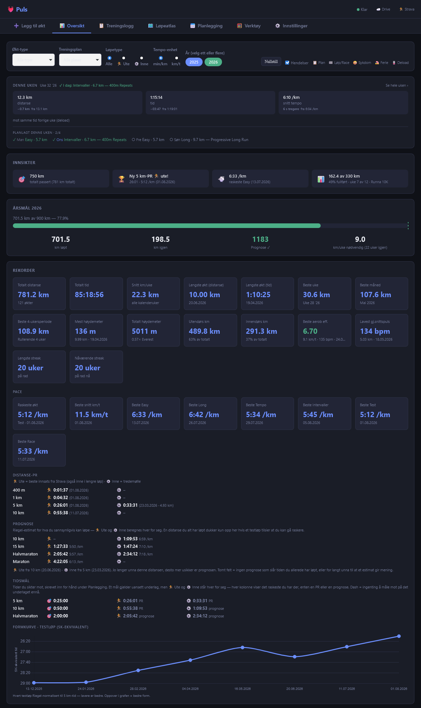
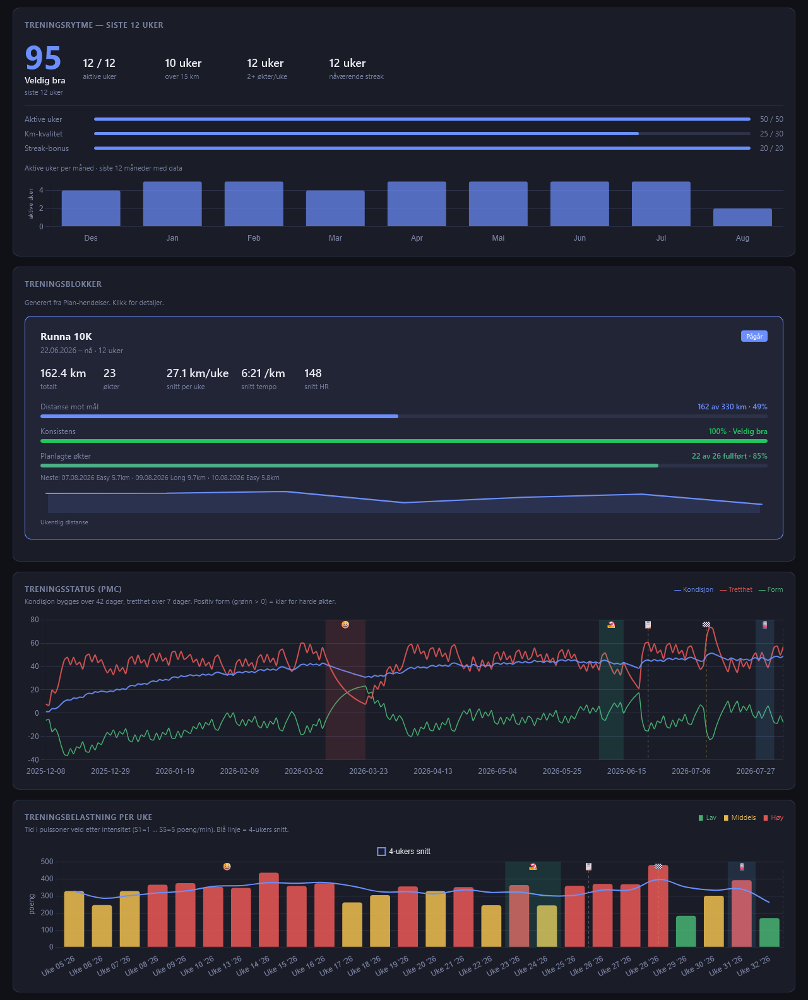
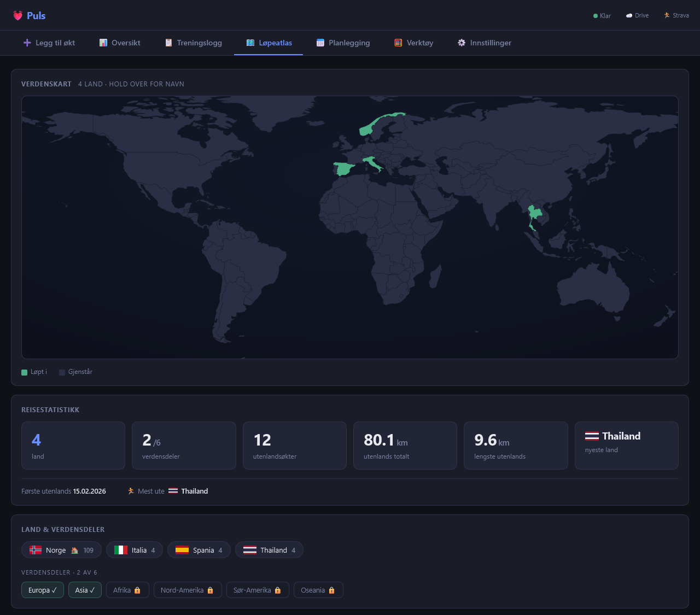
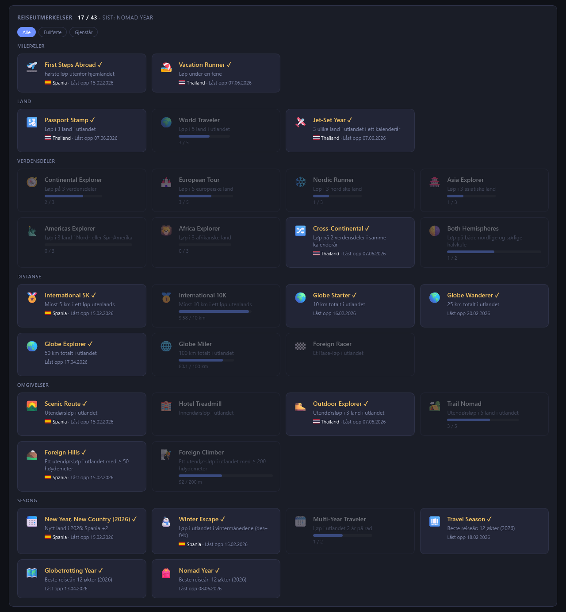
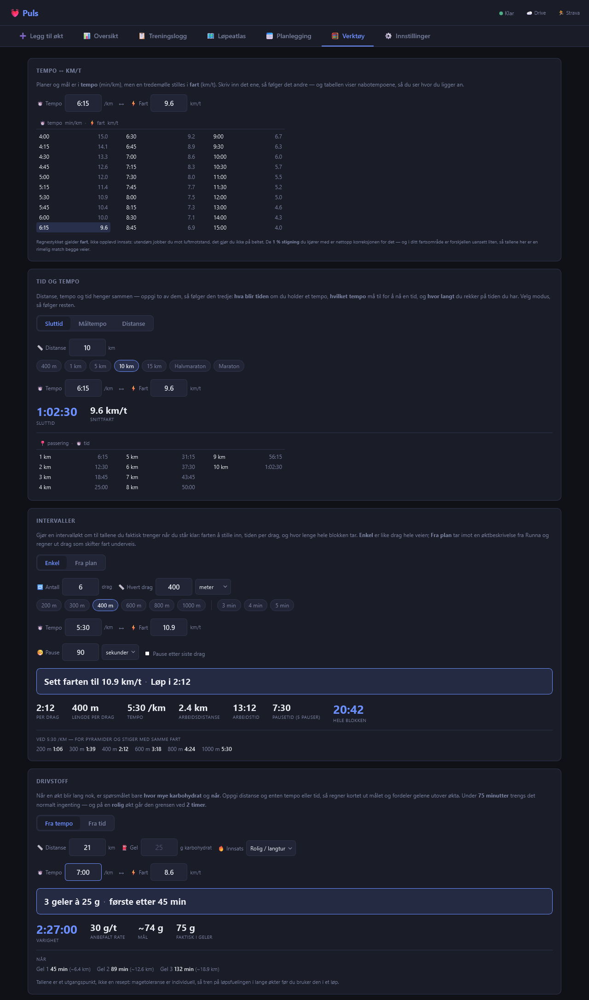

# Puls

*[Norsk](README.md) · English*

A self-contained single-file running tracker — log a run in seconds and follow your progress through records, insights, and trend charts. No install, no build step, no backend. Norwegian UI throughout.

**Works fully standalone** on a local JSON file — Strava-import, Google Drive sync, and Runna plan-import are each *optional* enhancements you can turn on if you want them, never required setup. Everything works with none of them configured. Where a feature does need one, the app says so rather than failing on click: a control that can't run yet is **disabled with the reason in text beside it**, and whole sections that don't apply are hidden instead of sitting dead in a form.

## Features

### Logging
- Log runs with date, session type (Easy / Steady / Long / Tempo / Intervaller / Test / **Race** — plus your own custom types via Innstillinger), training plan (also extendable), duration, distance, HR (avg + max), 5 HR zones, calories, pace, avg km/h, incline % (treadmill) or **elevation gain in metres** (outdoor), shoe, **RPE (1–10, in half-steps)**, **run type** (outdoor / treadmill), **workout description** (only shown when Treningsplan = Runna — paste Runna programs or interval structures; appears above notes in the form and as `[Øktbeskrivelse]` in AI exports), and **notes** (free-text post-run context for AI analysis)
- Auto-calculated fields: duration (summed from zones), pace, avg km/h — check **Uten pulsdata** in the Pulssoner header to hide zones and enter duration manually (e.g. when running without a watch)
- **Races are self-describing** — pick Økt-type **Race** and the form derives the two things you'd otherwise retype. **Øktnavn** comes from the 🏁 event on that date ("Berlin Marathon"), never from the programme; with no event registered it's left blank rather than invented. **Treningsplan** follows whether a training block covers the date: a goal race closing a Runna build keeps Runna, a parkrun outside every block drops to Egentrening. Both are ordinary editable fields — change either and your choice sticks
- **Plan prefill** *(optional, needs an imported Runna plan)* — when the form's date has a planned session, Økt-type, Mål distanse and **Øktbeskrivelse** are pre-filled from it — the last one carrying the session's actual prescription from the plan (warm-up, reps, pace targets, rest, cool-down), which Runna doesn't reliably push to Strava and so reached Puls no other way (Øktnavn follows automatically, e.g. "Runna Long"); a muted "📋 Fra planen (Runna): …" line shows when it happens. Everything stays editable — Mål distanse only fills when empty, so it never overwrites a value you typed, and editing a saved session never triggers a prefill
- **Venue autofill** — Tempo and Intervaller sessions pre-select **Tredemølle** automatically (they're always run indoors); Easy/Long keep your last-used venue. Overridable per session (the venue also drives the pre-selected shoe)
- **Hold utenfor analyse** — flag an atypical session (travel, illness, faulty HR strap, GPS glitch) so trends, insights, quality charts, and quality records skip it while its kilometres still count in all volume metrics, streaks, and totals; flagged sessions are always visibly marked (dimmed row in the log, an "Avvik" row in the session detail, and an `[Avvik]` tag in AI exports) — excluding is transparent, never silent; write the reason in Notater
- **Hent fra Strava** *(optional, requires Strava connection)* — button in the form pulls distance, duration, HR, HR zones, pace, elevation, and calories from a recent Strava activity, plus the Runna workout description when Runna pushed one to the activity (fills Øktbeskrivelse, never overwriting manually typed text); auto-selects automatically if exactly one run matches the date being logged, otherwise shows a picker (with a "Vis alle økter" link to always see the full list); only fills in fields — you still review and save manually. The activity's id is remembered on the saved session
- **Oppdater fra Strava** *(optional)* — when you edit a session that was originally filled from Strava, an "Oppdater fra Strava" button appears in the edit banner; it re-pulls that exact activity by id and refreshes only the Strava-derived fields (distance, duration, HR, zones, pace, elevation, calories) — your notes, Avvik flag, RPE, and shoes are left alone — then waits for you to review and save. Only appears on sessions logged from Strava going forward (older runs have no stored id)
- **Land** *(optional)* — the country a run took place in; leave it blank for home runs (empty means Norway) and only fill it for runs abroad. Norwegian country-name autocomplete; the field is prefilled from Strava when a fetched activity carries a country. Feeds the **Løpeatlas** tab
- After saving a new session, the app jumps to the session log automatically
- Edit any past session by clicking it in the log

### Dashboard (Oversikt)

*(All screenshots are generated from synthetic data.)*

- On a **fresh install** (no sessions yet) the dashboard shows a short "log your first run" greeting instead of an empty filter bar — matching the other tabs; the charts and filter bar appear once you've logged a session
- **Denne uken** — a thin strip at the top of the dashboard answering "how is this week going" without scrolling. Click it to open the full week. It reads **every** run regardless of the dashboard filters (like the yearly goal card), so "this week" always means this week.
  - **📋 I dag** — when a Runna plan is imported and a session is scheduled for today, the header carries **📋 I dag: Easy · 5 km · ~40 min**, turning to **✓** once you've logged it, so one line answers "what am I running today", "roughly how long will it take" and "have I done it yet". The duration is Runna's own estimate carried in the `.ics`, shown with a `~` because the source is itself rounded up to the nearest five minutes, and dropped once the session is done — what it actually took is on the logged session, and an estimate beside it would only invite the wrong comparison. Suppressed during a registered Sykdom/Ferie, and blank when nothing is scheduled — never "rest day", since only runs are imported from the plan, so absence isn't evidence
  - **Four tiles** — distance, time and average pace for the current week, each with its own comparison against last week **and last week's figure alongside it**: "+14:59" can't be read without knowing what it grew from, and for time and pace that baseline appears nowhere else. (The unchanged case is the exception — its baseline would just repeat the value above it.) The **session count appears only when it actually moved**, because it lands on the same number most weeks and a tile reading "3 økter, same as last week" reports nothing
  - **Like-for-like comparison** — this week *so far* against the **same days** of last week, never against last week's finished total, which would show a discouraging drop every Monday for no real reason
  - **Direction** — a green ▲ or red ▼, with **pace inverted** since a faster run is a smaller number: it reads "15 s raskere" in green with the arrow still following the value, so an improvement is never painted red
  - **Planned-low weeks** — during a registered **Deload, Taper, Sykdom or Ferie** every verdict turns neutral and names the reason instead. Running less is the plan working, not a shortfall
  - **The week's plan, at a glance** *(needs an imported plan)* — **Planlagt denne uken · 2/4**, then every scheduled session with its status: **✓ Man Easy · 4.5 km · ✓ Ons Long · 5 km · ○ Fre Intervaller · 4.5 km · ✗ Søn Long · 12 km**. The whole week stays listed all week, so you can see what you've done, what's left and what you missed without opening a card — a list that dropped its finished rows couldn't tell you whether the week started with four sessions or two. Done is green ✓, still ahead is ○, missed is a dimmed ✗ (not struck through — a missed session isn't cancelled), and today's day name is picked out in blue. Sessions you're excused from (Sykdom/Ferie) are left out **and leave the count**, so it never divides by a session it refuses to show. With no plan covering the week it falls back to the plain "Ingen økter ennå denne uken" — an absent plan is not a rest week
- **Yearly goal card** — progress bar with km done, km remaining, year-end projection, and required weekly km to stay on track; a **dashed projection marker** on the bar shows where the year-end forecast lands relative to the goal (green if on track, red if short), so the gap to target is visible at a glance
- **Rekorder** — five sub-sections. Everything here is derived from your runs; nothing is typed in by hand.
  - **Hovedrutenett** — total distance and time, avg km/week, longest session by distance and by time, best week / month / rolling 4-week block, most and total elevation gain (with an Everest multiple), outdoor vs indoor km, best aerobic efficiency, lowest avg HR on a run ≥ 5 km, longest and current streak. Aerobic efficiency and current streak are colour-coded (red/amber/green/blue), and the efficiency tile has a hover tooltip for the scale (Lav < 4.0 · Moderat 4.0–5.5 · God 5.5–7.0 · Høy > 7.0)
  - **Pace** — **Raskeste økt** (your fastest run of any type, with the **session type named beside the date**, so the row answers *which kind of session produces your fastest running* and not just what the number is), best avg km/h, then one card per session type. The type cards are **generated from the session-type list**, so adding a type gives it a card automatically. *Steady* is deliberately left out: it's a catch-all for runs that fit no other type, so a "best Steady pace" would average over a mixed bag and describe nothing
  - **Distanse-PR** — 400 m → marathon, one row per distance, with **two independent columns**. 🏃 **Ute** is Strava's best effort: the fastest stretch at that distance *inside any outdoor run*, so segments count and a fast 5 km within a 10 km run is a 5 km PB. ⚙️ **Inne** derives the same idea from the treadmill streams — the fastest continuous 5 km (etc.) inside any belt run — because Strava computes best efforts outdoors only. It falls back to a whole belt run at that distance, and the cell says which: a date alone is an exact split, a date plus a distance is a whole run. Three rules keep it honest:
    - Outdoor and treadmill are **never merged into one number** — belt and GPS measure differently, and belt reads systematically faster
    - A distance qualifies only within **±2 %** of the nominal length, so the label always means what it says — an empty cell beats a wrong one
    - Outdoor runners-up aren't mirrored here; Strava already shows the full ranking
  - **Prognose** — Riegel projections for the distances you *haven't* run yet, in the same two columns and **anchored separately per venue**: 🏃 Ute answers "what could I race?", ⚙️ Inne "what could I do on the belt?". Each prefers a maximal effort — a Test or Race in that venue — and falls back to your measured best there. The indoor column earns its place because roughly half the year every run is indoors, and an outdoor-only projection would sit frozen on last season's efforts all winter while your actual fitness moved. Indoor stops at a half marathon; a treadmill marathon estimate has no use. Each column names its anchor and date once, so a stale anchor is obvious at a glance, and the section hides entirely when there's nothing to project
  - **🎯 Mål** — the target times you set under Planlegging, each on a row beside where you actually are, so "where I want to be" reads next to "where I am". One row per goal only, so the section stays short. The goal itself covers both venues — an ambition isn't a treadmill setting — but what sits beside it are measurements, so it keeps the **same two 🏃 Ute / ⚙️ Inne columns** as the tables above, each showing the fastest thing that venue has and saying whether it's a **PR** or a **prognose**. A venue with nothing yet shows `–`. Nothing is derived from a goal — no countdown, no gap, no verdict; the section is hidden entirely until you set one
  - **Formkurve** — every Test/Race Riegel-normalised to a 5K-equivalent time and plotted as one fitness curve over time, so each new test extends the curve instead of living as an isolated PR. Up = fitter; appears once 2+ tests exist
- **Innsikter** — **first in the grid**, directly under Denne uken, because it's the only card carrying *deadlines*: a race countdown, a streak about to lapse, a "⚠️ Belastning ×1,6 — ro ned". Those are worth something today and nothing next week, while everything below is reference (records, projections, goals) you go to deliberately. The difference matters most on a phone, where the grid stacks and the Rekorder card is tall enough to push a warning far below the fold. A pool of candidates ranked by priority and recency, up to 6 shown — **fewer when fewer are worth showing**. Every card has to be an actual *event*, never filler, so a thin row means nothing noteworthy happened rather than that something was crowded out. **The load and volume cards say so when a reduced-running period (deload, taper, illness, holiday) sits inside what they are comparing** — and name which of the two windows it is in, since a quiet week in the baseline lifts the figure while one in the recent window damps it. A direction is only stated when *one* window is affected; with both, they pull opposite ways and the card names what is where rather than guessing. The load card says «stor belastningsøkning», not «høy skaderisiko» — what is measured is a load ratio, not an injury.
  - **Milestones & PRs** — km milestones (a passed one for its first 30 days only, after which it's a statistic and Rekorder owns it; an upcoming one once it's within reach, measured against your **last 4 weeks' volume** so "near" means about a month away at your current running, promoted at half that) · **fresh distance-PR** (14 days, naming the venue — "Ny 5 km-PR 🏃 ute!" — and reading the same computation the Rekorder card does, so the two can never disagree) · fastest Easy run (30 days, then Rekorder's tile carries it permanently)
  - **Trends** — Easy pace and **Easy HR** (last 8 vs prior 8 weeks) · **volume** (last 4 vs prior 4) · **RPE** (Easy average, 0.5-point threshold; shows a distinct *fatigue flag* when pace and HR hold steady but RPE still climbs — an early overreaching signal) · **Easy run Zone 2 compliance** (share of the **last 8 weeks'** Runna Easy runs whose avg HR landed in Zone 2 — a rolling window, so improving control actually moves the number; hidden below 3 recent runs rather than reaching back to fill the card)
  - **Warnings** — **ramp rate** (ACWR-lite: last 7 days' zone-weighted load vs the prior 28-day weekly average — warns above ×1.3, urgent above ×1.5, silent when load is sensible) · **shoe retirement** (fires when the Sko card's wear bar turns **red at 90 %** of the shoe's km limit, urgent past 100 % — the same `shoeWear` thresholds the bar and the Sko oversikt marks use, so one shoe is never described three ways at once. A shoe with **no limit set says nothing at all**; it used to be judged against a hidden 400 km that appeared on no screen) · **long-run gap** · days since last run · **max HR looks too low** — flags when logged peak HR has passed your configured maximum, since every zone boundary is derived from that number and a stale one quietly mis-scores every session. Needs **two** exceedances all-time (one reading is a sensor spike, two is evidence) with at least **3 bpm** of headroom, and one of them within 12 weeks so it ages out instead of nagging; runs flagged **Avvik** can't drive it, which is exactly what that flag is for
  - **Time-bound** — **race countdown** (priority 5 when ≤14 days) · **streak-at-risk** (Friday–Sunday, when a ≥3-week streak has no run yet that week) · **plan-target progress** (total km vs the active Plan event's target, with %-done against %-of-time; falls back to km-this-week vs the km/uke target, ✓ when reached) · **elevation this month**

- **Treningsrytme** — consistency score 0–100 over the last 12 weeks (active-week rate, volume threshold weeks, streak bonus); score breakdown bars show contribution of each component (max 50/30/20 pts); configurable km/run-count thresholds in Settings; monthly active-weeks trend chart; **availability-adjusted**: runless weeks covered by a Sykdom/Ferie event don't count against the score ("10 av 10 tilgjengelige uker") and the streak bridges them — running during a Ferie week still counts
- **Treningsblokker** — auto-generated training block cards from Plan events; active block is a full-width hero card with consistency progress bar and weekly km sparkline; past blocks shown as compact cards below; click any card for a rich drill-down: weekly progression bars (each row clickable → week detail; badges for Toppuke / Lengste løp / Raskest), auto-generated highlights (best week, longest run, streak, pace trend), consistency breakdown, HR zone distribution (stacked bar with low/high intensity summary), comparison vs the previous block, and full run list. For an **in-progress block**, the per-week rate (km/uke), runs/uke, and consistency are measured over the weeks **elapsed so far** — not the full planned span — so a block that just started doesn't read as low-volume or "inconsistent" for weeks that haven't happened yet (the total-km-vs-goal bar stays honest at its true % done). The **previous-block comparison is shown only once the block is completed** — a still-running block has partial volume and blocks can differ in goal (a 5K plan vs a 10K plan), so an early comparison would be misleadingly harsh
- **Treningsbelastning per uke** — weekly training load scored by zone intensity (Z1=1 … Z5=5 points/min), color-coded bars with 4-week rolling average
- **Treningsstatus (PMC)** — Performance Management Chart: Fitness (CTL, 42-day), Fatigue (ATL, 7-day), and Form (TSB = CTL−ATL) over the last 365 days
- **Ukentlig distanse** — km per week or month (Uke/Måned toggle); weekly mode shows last 26 weeks, monthly mode shows last 12 months; click a bar to drill into that week. A **Mål km** checkbox overlays a dashed target line on the bars — the sum of the **Mål distanse** set on that week's runs (which the Runna plan prefills), so you can see whether the week's distance target was met without it needing a chart of its own. Weeks with no target draw a gap, not a zero. The bullets on the line are coloured by how the week landed — blue over target, green reached, amber near, red under — while the bars keep their single colour, so a week with no target can never be mistaken for one that beat it. The checkbox is always off on load — it isn't remembered between sessions, the same as the other in-chart toggles. It appears only when targets exist, and **only in week mode**: a month where only some weeks were planned would sum to an undersized target and read as "way over plan" when it is really missing data
- **Tempo per uke** — weighted average pace per week or month (Uke/Måned toggle; week = last 26 weeks, month = last 12 months); switches title to "Tempo per måned" in month mode
- **Aerob effektivitet (rolige økter)** — aerobic efficiency trend (speed ÷ heart rate) for conversational-pace runs, with rolling average and personal average reference line. A rising trend means **lower HR at the same speed, or higher speed at the same HR** — improving aerobic form. **Run-type toggle** (Begge / Easy / Long) covers both easy and long runs; Steady/Tempo/Intervaller and other harder sessions are excluded by design (not Zone 2 targets). **Venue toggle** (Alle / Utendørs / Tredemølle) slices by run type; **Sone 2** filter isolates only runs where avg HR (or ≥70% of zone time) falls within configured Zone 2 — a cleaner aerobic signal that drops runs that drifted too hard
- **Interactive charts** — hover any weekly chart for a full week summary (km, løp, tid, tempo, HR); click a bar/point to open a drill-down detail panel for that week; click a shoe bar to open shoe detail. **The week panel knows which chart you came from**: arriving from Run/walk ratio, HR-drift & kadens, Høydemeter or Belastning adds that metric's own summary for the week — and each run in the list shows its individual value, so you can see *which* run moved the week rather than only the average. The figures are computed by the same roll-up the chart itself plots, so the panel can never contradict the point you clicked (the weekly running share, for instance, is weighted by time rather than being an average of each run's percentage). A metric that doesn't apply to a run — run/walk on a treadmill session — shows a dash rather than a zero
- **Ute vs inne** — stacked bar splitting km between outdoor (🏃) and treadmill (⚙️); Uke/Måned toggle (week = last 26 weeks, month = last 12 months); hidden until first treadmill session is logged
- **Høydemeter per uke** — total outdoor elevation gain per week or month (Uke/Måned toggle; week = last 26 weeks, month = last 12 months); sums the `hoydeMeter` field (Strava-autofilled) for outdoor runs only — treadmill incline (`stigning` %) is a separate metric and excluded; click a weekly bar to open that week; seasonal by nature, so the card is hidden entirely until there's outdoor elevation data
- **Run/walk ratio** *(optional, outdoor runs with Strava)* — estimates how much of an outdoor run was actually **running vs. walking**, derived from Strava's per-second speed stream (never manual entry). Each run's detail view shows a **stacked Løping / Gange / Uklart bar** plus tiles (longest unbroken run, run→walk transitions, data quality), an experimental uphill-walking line, and a collapsed **"ⓘ Hvordan beregnes dette?"** explainer. The dashboard card trends it over time with a **metric toggle** (Løping % ↔ Lengste sammenhengende løp) and a **Uke/Måned toggle** (week = last 26 weeks, month = last 12 months), hidden until at least one analysed outdoor run exists; click a weekly point to drill into that week. Walking and easy jogging overlap on speed, so the numbers are a **trend signal, not exact truth**. Time spent stopped is counted as stopped rather than running — standing at a crossing isn't a walk break, and a pause in the recording used to be credited with the speed you were running either side of it. New outdoor Strava runs are analysed **automatically on save** (one fetch per run — a routine edit re-fetches nothing); a one-time **Analyser alle Strava-økter** backfill in Innstillinger populates history in rate-limit-safe batches. Walk/run speed thresholds are configurable in Innstillinger (default gange < 7.0 · løping > 7.5 km/t — between the two = uklart)
- **HR-drift & kadens** *(optional, any Strava run — indoor + outdoor)* — two more estimates from the same Strava streams, shown in a run's **detail view**: **HR-drift** (aerobic decoupling — does your heart rate creep up while pace holds? computed as first-half vs second-half speed÷HR; lower or negative = more aerobically durable, most meaningful on steady/long runs) and **kadens** (average steps per minute). Because they read the HR sensor and accelerometer rather than GPS, they cover **every** Strava-linked run — including treadmill, unlike run/walk — and are analysed automatically on save (or via the same backfill). Time spent stopped is left out of HR-drift entirely — your heart rate stays up while you stand still, so counting those seconds would show drift you never had. Walking still counts, since a walk break is part of the run. Estimates; HR-drift is noisier on runs with walk breaks or hills, so read it on continuous easy/steady runs and compare indoor-vs-indoor / outdoor-vs-outdoor. The **dashboard also trends both over time** — a **metric toggle** (HR-drift ↔ Kadens) and a **Uke/Måned toggle** (week = last 26 weeks, month = last 12 months), drawing **two venue-separated lines** (🏃 Utendørs / ⚙️ Tredemølle) rather than one blended average, since steady near-zero treadmill drift mixed with hilly outdoor drift would make a week look worse just for training outdoors more; the HR-drift view marks the zero line, and clicking a weekly point drills into that week. Hidden until at least one Strava run has been analysed
- **Beste splits** *(optional, treadmill runs with Strava)* — Strava works out your fastest 5 km, 10 km and so on **inside** any outdoor run, but never does it for treadmill runs. Puls fills that gap from data it already downloads: it scans every possible window through the run and keeps the quickest, so a fast stretch buried in the middle of a longer session counts as the personal best it is. Analysed automatically on save; the **Analyser alle Strava-økter** backfill fills in history.
  - **Where it shows** — each treadmill run's detail view lists the splits it produced and where in the run they started, and the best across all runs feeds the ⚙️ Inne column under Distanse-PR
  - **🏆 on a record-holding split** — marked right there in the run, so a PB is visible where you're already looking. It means "this is the record *now*", not "this was a best on the day": it disappears once a later run beats it, so an old session never claims a record it no longer holds
  - **Moving time only** — a pause mid-run doesn't make the stretch around it look slower, the same basis as the session's own duration
  - **A measurement, not an estimate** — unlike run/walk and HR-drift nothing is classified or smoothed, because a treadmill run recorded through Runna takes its distance from the belt speed you enter
  - **Two trust checks, and it says which one failed.** Runs recorded with the watch alone measured your wrist rather than the belt and can read ~18 % long, so a stretch cut from one would be fast in the wrong units. Splits are therefore taken only when the downloaded distance agrees with your logged distance to within **3 %** *and* the run carries a **cadence** reading — in practice what separates a Runna recording from a watch-only one. A run failing either check contributes no splits, and its detail view names the reason
- **Koble gamle økter til Strava** *(one-time, Innstillinger)* — sessions logged before the Strava-id field existed (older, manually-entered runs) have no activity link, so they can't be analysed. This one-time job pages your Strava history and proposes matches by **date + venue + distance/duration**, requiring a **unique** confirming activity so it never guesses. You **review and approve** each match — both-signals-agree (`dist+tid ✓✓`) are pre-checked; single-signal (`kun tid` / `kun dist`) and date-only (`kun dato`) matches are flagged and left for you to tick, since a wrong link would silently attach another run's data. Duration covers **intervals** (whose logged distance often omits the recovery jog Strava's GPS still records), and the date-only tier catches the common one-run-a-day case where a hand-entered distance has drifted. Approved sessions are linked and handed to the analyzer, so they join the run/walk + HR-drift & kadens detail views and trends. Multiple activities on one day (a warmup/main/cooldown split) are left unmatched rather than guessed. Shown only while signed in to Strava and some session is still unlinked
- **Pulssoner** — stacked minutes per zone per week or month (toggle)
- **Årssammenligning** — cumulative km by week number, one line per year; summary table below the chart shows total km, run count, and avg km per active week per year (color-coded to match chart lines)
- **Sko oversikt** — total km per shoe pair + per-shoe stats: run count, avg pace, avg HR, last used date. ⚠️ past 90 % of the shoe's limit, 🔴 past 100 %
- **Ukentlig oversikt** — scrollable summary table (økter, distance, **time**, avg pace) with a **Uke/Måned toggle** to compare each metric per week or per month. The **current week (or month) is highlighted** and tagged, so the row you're actually living in is findable in a table of otherwise identical rows; it follows the toggle, and is simply absent if nothing matching your filters has been logged in it yet. The column header stays pinned while scrolling, and a **sticky footer** keeps two summary rows always in view: a **Snitt** row (per-active-period averages — a typical week/month — plus overall average pace) above the **Totalt** row

**Event markers (Hendelser)** — training events (plan / race / sykdom / ferie / deload / taper / annet) show on the weekly charts as a compact **icon rail** across the top (📋 🏁 🤒 🏖️ 🪫 📉 📌); anomaly periods (sykdom/ferie/deload/taper) also shade a soft band, and plans stay as a baseline marker. **Hover** an icon for the event's title, type, and date range; markers that bunch up **collapse into a count badge** (hover lists them all). A matching **legend** sits by the Hendelser toggle when there are ≥2 event types. Toggle all markers with the **Hendelser** checkbox (off by default on small screens).

Dashboard filters: session type, training plan, run type (outdoor/treadmill), **tempo unit (min/km ↔ km/t)**, year pills — all charts update live. The tempo unit toggle switches "Tempo per uke" between pace and speed. **Nullstill** resets all filters including chart-local type pills (incl. the Run/walk ratio and HR-drift & kadens metric toggles), the **Mål km** checkbox on Ukentlig distanse, the pace unit toggle, and every Uke/Måned toggle (Ukentlig distanse, Tempo, Pulssoner, Ute vs inne, Høydemeter, Run/walk ratio, HR-drift & kadens charts + the Ukentlig oversikt table).

**Mobile:** all charts resize to fit the screen width — no horizontal page scrolling.

### 🗺️ Løpeatlas (own tab)
A motivational travel section (grew out of "Land løpt i") living in its own tab, always fully expanded. Everything is derived from your runs and events — the only thing you ever type here is a per-country note. Empty-`land` runs count as Norway, so only trips abroad need the Land field set.

- **Verdenskart** — an inline SVG world map (real country borders, ~120 KB of baked-in geometry, **no library and no network calls**) with every country you've run in filled green. Hover for the name; **click a lit country** for its drill-down
- **Reisestatistikk** — stat tiles (land · verdensdeler N/6 · utenlandsøkter · utenlands totalt · lengste utenlands · nyeste land) plus a venue meta line under a hairline: Første utenlands · 🏃 Mest ute *land* · ⚙️ Mest inne *land*
- **Land & verdensdeler** — one flag chip per country (flag, Norwegian name, all-time run count, Norway first) and a row of continent pills (Europa ✓ green / Afrika 🔒 muted …). Flags are **inline SVG in the file itself**, not fetched from an image CDN: one flag request per country would tell a third party exactly which countries you have run in, every time you open the tab. Only countries actually run in are carried (the whole set is 1.6 kB) — a country without one shows the **name alone** rather than a broken image

#### Reiseutmerkelser

**30+ auto-derived travel achievements** in six groups, with progress bars on the locked ones. Tiered ladders show **only your next goal** — no redundant 3/5, 3/10 stacking — and each unlocked badge names the **flag + country where you earned it** wherever a single place applies.

- **Land** — foreign-country tiers: Passport Stamp → World Traveler → Frequent Flyer → Globetrotter (these count *foreign* countries only)
- **Verdensdeler** — regional explorers (European Tour, Asia/Americas/Africa Explorer), Continental Explorer, Global Runner, Cross-Continental, Both Hemispheres (a 1/2 badge whose drill-down names which hemisphere — nordlig/sørlig — you've reached), and Nordic Runner/Complete
- **Distanse** — single-run milestones abroad (5K/10K/Half/Marathon), a cumulative-km-abroad ladder (Globe Starter 10 → Wanderer 25 → Explorer 50 → Miler 100 → Voyager 250), and Foreign Racer
- **Omgivelser** — Scenic Route, Hotel Treadmill, an outdoor-countries ladder (Outdoor Explorer 3 → Trail Nomad 5 → Wilderness Wanderer 10) and a single-run elevation ladder (Foreign Hills 50 → Foreign Climber 200 → Foreign Summit 500 m)
- **Sesong** — Winter Escape; a **Multi-Year Traveler** ladder (2 → Seasoned 3 → Veteran 5 consecutive calendar years run abroad, counting *any* foreign country); a **best-travel-year** ladder (Travel Season 3 → Globetrotting Year 6 → Nomad Year 10, labelled with the year — "Beste reiseår: 6 løp (2026)"); and a permanent per-year **New Year, New Country** stamp for each year you first set foot somewhere new, the current year showing as a locked objective until you do. Both year ladders are **banked** — a gap year never lowers a record you've already earned

**Two drill-downs that are inverses of each other.** Click a **badge** for its status, the full ladder (every level with a ✓ or its tally, your current one highlighted), and the countries/continents counting toward it as clickable chips. Click a **flag chip** for that country: a stat grid (løp, distanse, and per-country records — lengste løp, raskeste tempo skipping flagged outliers, mest høydemeter), a meta block with the **date range** 📅 and the **ute/inne split** 🏃/⚙️ (always shown — "Alt utendørs" when the country isn't mixed), a **"Teller mot"** list of the badges it counts toward (gold ✓ = unlocked *here* · green ✓ = unlocked elsewhere, but this country counts · grey tally = in progress), and a free-text **memory note** 📝.

An **Alle · Fullførte · Gjenstår** filter switches between every badge, the earned ones, and what's left as a to-do list with progress bars.

### Session log (Treningslogg)
- Full sortable table — click any column header to sort
- **Høyde column** shows elevation in metres for outdoor runs and incline % for treadmill runs
- **RPE column** shows effort rating 1–10 in colour (green ≤3 · amber ≤6 · orange ≤8 · red above); logged in **0.5 steps**, so `6.5` sits between *Tungt* and *Veldig tungt* — and lands in the orange band; hidden on mobile
- **📋 icon** shown in the session name column when a workout description exists — hover to preview; **📝 icon** shown when a note exists — hover to preview
- **Responsive columns:** > 1600px shows everything; ≤ 1600px hides only Uke and Sko (keeps Mål km, Varighet, ♥ Topp, Høyde, RPE — tested on 14" HiDPI laptop at 150% scaling = 1536px CSS viewport); ≤ 900px also hides Varighet, ♥ Topp; ≤ 600px additionally hides Navn and Plan — all hidden fields stay reachable via the row detail view below
- Filter by date range, session type, run type (outdoor/treadmill), and shoe
- **Click any row** to open a full read-only detail view — every field, including the ones the table doesn't show (calories, avg km/t, country, pulse zones) and the complete workout description + notes — without entering edit mode. Especially handy on mobile, where most columns are hidden
- ✏️ to edit or 🗑️ to delete any row
- **Export for AI chat** — checkbox column to select one or more sessions; **Kopier valgte** copies selected rows, **Kopier alle filtrerte** copies the full filtered view, **Last ned TSV** downloads as a file, and **Uten notater** leaves your own notes out of all three (Øktbeskrivelse from the plan still goes — it is the programme's prescription, not your comment; the choice is deliberately not remembered, so a later export never silently drops notes); single header row at the top, then one block per session: `=== YYYY-MM-DD | Øktnavn | dist km ===` header — carrying `| Avvik` and `| Uten pulsdata` on the same line when they apply — an optional `[Øktbeskrivelse]` block (workout plan/structure), an optional `[Notater]` block (your own notes), `[Data]` and the data row, then an optional `[Analyse]` block — everything you wrote sits above the row and everything measured from Strava sits below it; blocks separated by blank lines. **Every part is labelled**, so nothing can read as a continuation of the part above it. The date is `YYYY-MM-DD` in the data row too, matching the header (`8/10/2026` could be read as either 8 October or 10 August), and **the HR zones are blank rather than `0:00:00` when a session has no zone data at all** — a zero claims something was measured. The **`[Analyse]` block carries the two things no column could** — **run/walk ratio** (longest continuous run, transitions to walking, uphill walking, data quality) and **HR-drift & cadence**. Run/walk is **outdoor only** since it reads GPS speed second by second, while HR-drift and cadence come off the HR sensor and accelerometer and appear for treadmill runs too; a session simply omits what doesn't apply. It uses the same staleness rules as the detail panel, so an export never contains analysis the app itself has withheld, and warnings are printed only when data quality isn't high — that's when the reason is worth having

### Planning (Planlegging)
- **Yearly goals (Mål → Årsmål)** — set a km target per year, tracked on the dashboard; ✏️ opens a proper edit mode (the year locks, the button switches to **Oppdater**, and an **Avbryt** button appears to back out)
- **Target times (Mål → Tidsmål per distanse)** — the time you're aiming for on a distance, written as `25:00` or `2:00:00`. Each one gets a row in a **🎯 Mål** section under Distanse-PR and Prognose on the dashboard, so what you want sits beside what you've done and what you're trending toward. Only distances you've set a goal for appear. Available from 1 km up, the same floor Prognose uses. A goal covers both venues (an ambition isn't a treadmill setting), but the row keeps the two 🏃 Ute / ⚙️ Inne columns — each showing the fastest thing that venue has, labelled **PR** or **prognose**, and `–` when there's nothing yet. Type `25:00` or `2:00:00` — or just `45`, which means 45 minutes, the same way a bare `6` in a pace field has always meant 6:00. Everything displays padded as `0:25:00`, since `3:45` alone could be 3 min 45 s or 3 h 45 min. Nothing is computed from a goal — no countdown, no "X to go"; it's a note that happens to sit in the right place. ✏️/🗑️ edit and remove, same as Årsmål
- **Kommende blokker** — a place to note the training blocks you're *considering*, when you only know them roughly: pick the distance (5 km / 10 km / Halvmaraton / Maraton / Annet), an optional **rough month and year** rather than a date, an optional length in weeks, and a free-text note. Undated entries sort last and read *ikke bestemt*. **Nothing here is counted anywhere** — no countdown, no chart, no adherence, no training block. It's a note, deliberately: a real Plan event needs firm dates and would reshape your current block, whereas "an HM sometime after new year" is an idea. When one becomes real, **Start blokk** fills in the Hendelser form for you — you set the actual dates and save, which is also the moment to import that plan's `.ics`
- **Hendelser** — events (Plan / Løp/Race / Sykdom / Ferie / Deload / Taper / Annet) shown as vertical markers on the charts; events with an end date render as spans — anomaly periods (Sykdom/Ferie/Deload/Taper/Annet) get a shaded fill, while Plan events draw start/end boundary lines only (a multi-week plan fill would tint the whole chart); the Hendelser chart toggle defaults off on small screens where the markers crowd the charts; Plan events can carry a total-km target (headline metric — steadier than weekly, since deload/taper weeks legitimately vary) plus optional weekly km/run targets, and drive the Treningsblokker cards; ✏️ opens the event in the form for in-place editing (e.g. adding an end date after the fact) — the button flips to "Lagre endringer" with an Avbryt escape
- **Sko** — manage shoe list with km totals; set an optional **km wear limit** and **obtained month** per shoe (via **Rediger** on existing shoes) so each card shows its **age** (e.g. "Kjøpt jun 2024 · 1 år 1 mnd") next to the km-wear bar; **Pensjonér** a shoe to hide it from the form dropdown while keeping historical data; **Aktiver** restores it; used in the log filter and form dropdown. A **Standard sko** row picks a default shoe per venue (*Utendørs* / *Tredemølle*) — the log form pre-selects that shoe by run type (and swaps when you toggle Ute↔Inne), still overridable per session
- **Løp & Races** — lists all race events with matched session stats. A race event can carry an optional **Distanse (km)**, which shows on upcoming races (where the stats line was otherwise blank), is named in the race-countdown insight, and lets the session match pick the run *closest to that distance* rather than the longest one nearby. It also appears in the **Hendelser** row itself, in the space a race's missing end date leaves — "Runna 5K test" carries the distance in its name, "adidas x Anton Sport: Social Run" doesn't, and since the field steers which run gets matched, a blank one is worth being able to see. Selecting **Løp/Race** in Hendelser swaps the Sluttdato field for Distanse — a race is one day. Both Hendelser and Løp & Races show the **10 most recent** by default with a **▾ Vis alle (N)** / **▴ Vis færre** toggle when there are more
- **Planlagte økter** *(optional)* — an opt-in enhancement, not a required step; Puls works fully without it. Import your **Runna** training-plan calendar (`.ics`) to track planned-vs-actual. In Runna: *Profile → Connected Apps & Devices → Connected Calendar → Other calendar → Copy URL*, open that link in a browser to download the `.ics`, then pick it here. **Picking the file only shows you what it would do** — how many sessions it found, the date span, how many fall outside the active block and get skipped **together with the dates they span**, and how many stored sessions would be replaced or kept — and nothing is written until you confirm. One import per training block covers the whole block, and a file carrying several blocks imports them all — each block is replaced **within its own date range only**, so a block the file doesn't cover is left untouched. Sessions falling outside every registered block are skipped, since there'd be nothing to scope them to. **Import at or just before a block starts** — that's the only moment Runna's feed holds the *whole* plan as upcoming. Once a block is running, a session you skip disappears from the feed entirely, so a plan imported late is missing exactly the days you missed. Re-importing later is safe: it replaces only the dates it carries and keeps the rest, so sessions you already recorded as missed aren't erased. And a plan rebuilt purely from completed sessions **reports a count rather than an adherence percentage** — with the misses absent from the data, any percentage would be 100% by construction. Imports are **additive across blocks** — a new block's import replaces only its own date range, so every finished block keeps its plan and still shows its planned-vs-actual in its block detail view. The card itself lists **one block at a time** — the one you're running, or the most recent when you're between blocks — with every other block collapsed to a single row under **Andre blokker**, showing that block's own adherence and opening its detail view when clicked. So it stays the same size whether you've imported one plan or ten, and there is no "when is it safe to re-import". Each planned run gets a **done ✓ / missed ✗ / upcoming ○** status — matched to your logged runs by week + nearest date + type — plus a block adherence count; strength and ad-hoc runs are skipped. Two rules keep a run from completing a session it has nothing to do with: a run logged **before** its planned day only counts when the **type matches** (Wednesday's Long run on Tuesday counts; Tuesday's intervals are not Wednesday's Long done early), and a session logged as **Egentrening** never completes a programme's session at all — that's what the field means. Swapping intensity on the day is still a completed session, not a miss. When several runs and sessions compete in one week, the **clearest pairs are settled first** rather than the earliest planned session claiming whatever is available — so missing one session mid-week no longer shifts the credit onto every later one and reports the last session of the week as the miss. A run planned for **today** stays *upcoming* (○), not missed — it only turns ✗ once the day has fully passed, and it's left out of the adherence count until then, so an unfinished session today never drags the percentage down. Sessions that fall inside a registered **Sykdom or Ferie** period are marked *excused* (–) and left out of the adherence count too — you weren't available, so they don't count as missed (a run you *did* do while away still counts as done). This mirrors how **Treningsrytme** already excuses those weeks. The imported plan also feeds the **active training-block card** on the dashboard (an adherence bar + your next few sessions), the block's detail panel (the full planned list), and the **log form's prefill** (Økt-type + Mål distanse for that day — see Logging)

### 🧮 Verktøy (own tab)
Stateless calculators. **None of them read your data** — that is the defining rule of the tab, not an implementation detail: they have to answer for paces you have never run (a plan target, someone else's race, a goal you are not yet fit for). Nothing here is saved, so nothing here can go stale.

- **Tempo ↔ km/t** — your plan and targets are written in **pace** (min/km) but a treadmill is set in **speed** (km/t), so the conversion comes up before most indoor sessions — and again when reading someone else's run. Type either side and the other follows, rounded to one decimal because that's what a treadmill accepts. Below it a reference table from 4:00 to 15:00 per km — both ends round in km/t (15.0 and 4.0), reaching interval reps at the top and a treadmill recovery walk at the bottom — with the row nearest your current value highlighted, so an answer arrives with its neighbours rather than alone. The step coarsens twice (30 s below 9:00, 60 s below 12:00): partly because 15-second resolution on a walking pace is false precision, and partly because a fixed 0.1 km/t step buys more and more pace the slower you go, so finer rows down there would not survive a round trip through the speed column. The arithmetic is **speed, not effort** — outdoors you work against air resistance and on a belt you don't; the 1% incline the log form defaults to is the standard correction for exactly that
- **Tid og tempo** — one card, three modes, because distance, pace and time are one equation: give it any two and it solves for the third. **Sluttid**: distance + pace → finish time and average speed ("10 km at 6:15 → 1:02:30, 9.6 km/t"). **Måltempo**: distance + target time → the pace it actually takes ("5 km in 29:30 → 5:54/km"), with round **Sub-30 / Sub-27:30** style chips bracketing whatever you typed — generated from the value in the box, never from your PRs, so they stay useful as you get faster and still work for a distance you have never raced. **Distanse**: time + pace → how far that gets you ("35 minutes at 6:20 → 5.53 km"; a bare `45` in the time field means 45 minutes), for the run you plan by the clock rather than by the distance. Whichever number the mode solves for stops being a field, so you never type something the card ignores. The two distance-driven modes share a picker (free km entry plus presets from 400 m to marathon, matching the Distanse-PR table so the labels mean the same thing), and all three share a **split table** — every kilometre up to 10, then every five, always ending on the real distance, so a marathon is 17 rows rather than 42. Switching mode keeps the distance you already picked, and a distance the card worked out for you is never written back into that field
- **Intervaller** — turns a prescription into the numbers you need standing at the belt. The loudest line is deliberately the one you read in the ten seconds before starting: **"Sett farten til 10.9 km/t · Løp i 2:12"**. Below it, per-interval and session totals — work distance, work time, recovery time and the whole block. Works from either direction: `6 × 400 m @ 5:30` or `5 × 3 min @ 10.5 km/t`. **Six reps means five recoveries**, and the count is printed rather than implied, since getting it wrong misstates the block by a whole recovery; a checkbox adds a trailing recovery when the session has one. Recovery entered as a *distance* leaves the block duration blank **with the reason attached** — how long 200 m takes depends on a recovery pace you haven't given, and a plausible invented number is worse than an honest gap. A **distance ladder** at the entered pace (200 m → 1 km) covers pyramids and ladders, which normally hold one pace and vary only the distance, so the belt setting never changes and only the rep times are missing. A **Fra plan** mode covers what that ladder cannot: paste the Runna prescription for a session whose pace changes between reps — a pyramid, a progression, a mixed set — and it lists every rep with its speed and time, then the block. It parses both units (`5:40/km` and `10.6kph`), both of Runna's grouping forms (`5 reps of:` and `Repeat the following 3x:`), and past sessions as well as upcoming ones, ignoring the `Laps` block of what you actually ran. **Anything it cannot time is named, never quietly left out** — most Long runs are built from `8km at a conversational pace`, which carries no pace anywhere, so the card says which distance is uncovered rather than reporting a total that silently excludes it. Cross-checked against Runna's own duration estimate on real sessions.

Numbers accept a comma or a point on input; output always uses a point. Leniency stops there: anything that is not a usable number or time gets a **red border** and no answer, rather than being quietly reinterpreted. `10:84` is not 11:24, `10abc` is not 10, and an empty field is not an error — it is where you started.

### Settings (Innstillinger)
- **Profil & Puls** — max HR, resting HR, 5 zone boundaries; auto-calculate zones from max HR, or import your real boundaries directly from Strava *(requires Strava connection)*; zone boundaries drive HR zone analysis in training block drill-downs, Easy run Zone 2 compliance insights, and the Zone 2 efficiency filter
- **Distanse-PR** — **nothing is typed in by hand**; both columns are derived from your logged runs. **⚙️ Inne** comes from the treadmill sessions themselves, by whichever is faster: the fastest continuous stretch at that distance inside an *analysed* run (the same thing Strava does for outdoor runs), or a whole treadmill run within ±2 % of the distance. No qualifying session means an empty cell — that's the honest answer, not a gap to fill. **🏃 Ute** comes from a **Synkroniser fra Strava** button *(requires Strava connection)* that scans your full history in rate-limit-safe, resumable batches and builds the top 3 per distance, whose fastest becomes the column. The two venues are kept apart on purpose and never merged. *(A hand-entry fallback existed until 2026-08-05; it was removed because both automatic sources already covered it and a typed value would silently resurface as your PR whenever a faster derived one dropped out.)*
- **Strava** *(a section inside the **Datafil** card, below Google Drive)* — connect via OAuth to enable the Hent fra Strava form helper, zone import, and the best-efforts sync that builds your 🏃 Ute distance PRs; requires a small Cloudflare Worker for the OAuth token exchange (Strava's API needs a client secret that can't live in browser code) — see [worker/README.md](worker/README.md) for deploy steps, entirely through Cloudflare's dashboard with no local tooling required; paste your Client ID and the Worker's URL, then click "Koble til Strava"
- **Treningsrytme** — km-grense and løp-grense per week used to compute the consistency score
- **Run/walk ratio** *(also inside the **Datafil** card, at the bottom; requires Strava connection)* — walk/run speed thresholds for the outdoor running-vs-walking estimate (**gange under** / **løping over**, km/t; default 7.0 / 7.5 — adjust to your own pace if the estimate looks off, since walking and easy jogging overlap), plus a one-time **Analyser alle Strava-økter** button that backfills the analysis across your Strava-linked history (run/walk on outdoor runs + HR-drift & kadens on all runs) in rate-limit-safe, resumable batches so the trends and detail stats fill in
- **Økttyper** and **Treningsplan** — two cards for adding your own session types and training plans; they appear in the form and filter dropdowns alongside the built-in ones (which stay fixed, and can't be removed), and can be deleted again when unused
- **Datafil** — open, create, download, or clear all data. The card also hosts, in order, **Lokale sikkerhetskopier** (automatic daily snapshots in browser IndexedDB, last 7 days, one-click restore — a snapshot is also taken right before a clear-all, so that is recoverable too), then the **Google Drive**, **Strava** and **Run/walk ratio** sections below
- **Google Drive** *(a section inside the **Datafil** card)* — connect once via OAuth (PKCE flow); paste your Client ID and Client Secret from Google Cloud Console, click "Koble til", and data syncs silently on every save; connection persists across page reloads via a stored refresh token; Drive takes priority over the local file when connected — the local file status and sync indicator are hidden, only the ☁ Drive indicator is shown (and **Innstillinger → Datafil** reads «Synkroniseres via Google Drive»)

---

## Getting started

Open `puls.html` in your browser — no install needed. Or use the hosted version at **[psvadev.github.io/running/puls.html](https://psvadev.github.io/running/puls.html)** (navigating to the root redirects automatically). A small footer at the bottom of the page shows the currently deployed commit (fetched live from GitHub, with the last known version cached locally so it survives API hiccups), so you can confirm you're on the latest version.

First-time users see a short in-app welcome message on the logging form (a centered greeting matching the other tabs' empty states, with a link straight to ⚙️ Innstillinger) explaining the save flow — it disappears automatically after your first session is logged.

A quiet **"Om Puls — dokumentasjon på GitHub"** link sits at the bottom of the ⚙️ Innstillinger tab (below the Datafil card), opening this repository in a new tab.

### First time (no existing data)

1. Add a session in **➕ Legg til økt** and click **Lagre økt**
2. A save dialog appears automatically — pick a folder and name (default: `puls.json`)
3. All future saves happen automatically in the background

(**⚙️ Innstillinger → ✨ Ny fil** also works if you prefer to create the data file before logging anything.)

### Loading an existing JSON file

1. Go to **⚙️ Innstillinger** → click **📂 Åpne fil**
2. Select your `puls.json` — data loads immediately across all tabs
3. The app remembers the file; next time you open it a one-click prompt restores access without re-picking

### Google Drive sync (optional, cross-device)

1. Go to **⚙️ Innstillinger** → **Datafil** → **Google Drive**
2. Paste your **Client ID** and **Client Secret** (from [Google Cloud Console](https://console.cloud.google.com/) → Credentials → your OAuth 2.0 client)
3. Click **Koble til Google Drive** — you are redirected to Google sign-in and back
4. A `puls.json` file is created in your Drive (or the existing one is loaded)
5. Every subsequent save syncs automatically — no further clicks needed

The ☁ Drive indicator in the top bar turns green when connected. Data is cached locally so the app loads instantly on reload without waiting for Drive. On every page load the app silently re-fetches from Drive in the background, so changes from other devices appear automatically.

When Drive is active, the local file status and sync indicator are hidden — the Drive indicator is the only status shown. If you manually open a local file via Settings, both reappear alongside Drive sync.

**Sync safety.** If Drive's copy has fewer sessions than this device, or this device has edited more recently, connecting **asks first** rather than overwriting — the same way uploading already asks. When a Drive save fails (offline, expired token), the app remembers that there are unpushed local edits **across reloads**, so the next page load can't quietly replace them with Drive's older copy; you get the conflict prompt instead. A save that fails to reach the file or Drive shows a **red sync indicator that stays put** plus a message — it never reports "Lagret" for a write that didn't happen.

If you open the app on a new device, repeat steps 1–3 once; the same Drive file is used.

**Requirements:**
- The app must be served over HTTP — either `python -m http.server 8080` locally or a hosted URL (GitHub Pages etc.). Opening `puls.html` directly as a `file://` URL will not work for Drive sync (OAuth requires an HTTP redirect URI).
- The redirect URI must be registered under *Authorized redirect URIs* in Google Cloud Console. Add both if using locally and on GitHub Pages:
  - `http://localhost:8080/puls.html`
  - `https://<your-username>.github.io/<repo>/puls.html`

Opening `puls.html` directly as a local file still works fully for offline use — only the Drive sync feature requires HTTP.

---

### Strava integration (optional)

1. Register a Strava API application at [strava.com/settings/api](https://www.strava.com/settings/api) — copy the **Client ID** and **Client Secret**
2. Deploy the OAuth token-exchange Worker — see [worker/README.md](worker/README.md) for full steps; works entirely through Cloudflare's dashboard, no local tooling required
3. Go to **⚙️ Innstillinger → Datafil → Strava** (a section near the bottom of the Datafil card), paste in your **Client ID** and the Worker's URL, then click **Koble til Strava**
4. Once connected:
   - **Hent fra Strava** appears in the logging form to pull in distance/duration/HR/pace/elevation/calories from a recent run, plus the Runna workout description if Runna pushed one to that activity
   - **Fra Strava** appears next to the zone auto-calc button in Profil & Puls
   - **Synkroniser fra Strava** appears under Distanse-PR to pull your all-time outdoor best efforts (the 🏃 Ute column)

**Strava's** Client Secret never leaves the Worker — only the Client ID and Worker URL are stored in localStorage. Note this differs from **Google Drive**, whose flow runs entirely in the browser: its Client Secret *is* stored in localStorage alongside the refresh token (the flow is actually secured by PKCE; the secret is only there because the Google client is registered as a "Web application" type). Drive access is scoped to `drive.file`, so it only ever reaches files this app created.

---

## Firefox & Safari

Firefox and Safari do not support the File System Access API, so local auto-save is unavailable. **Google Drive sync is the recommended alternative** — it works fully in both since it uses standard `fetch()` calls, not the File System Access API. Serve the app over HTTP and follow the [Google Drive sync](#google-drive-sync-optional-cross-device) setup above.

Without Drive sync:

- Load data: **⚙️ Innstillinger** → **📂 Åpne fil** (standard file input)
- Save data: **⚙️ Innstillinger** → **⬇️ Last ned** after each session to download the updated JSON
- Re-open the downloaded file next time to continue where you left off
- In this mode the save indicator reads **"Kun i nettleser — husk Last ned"** as a persistent reminder: your data is only in the browser's cache until you download it, so clearing browser data without downloading first would lose it

---

## Stack

Single `.html` file — no build step, no framework, no install.

The tab strip is **responsive but singular** — not two navigations: below 600 px it moves to a fixed bottom bar of six slots (Legg til · Oversikt · Logg · Plan · Verktøy · Mer), with Løpeatlas and Innstillinger behind **Mer**. The old horizontally-scrolling strip is gone; tabs past the right edge were reachable but undiscoverable. A separate mobile menu would be a *second* source of truth for which tab is active, so the same `.tabs` element is restyled instead.

- [Chart.js 4.4.0](https://www.chartjs.org/) — charts, loaded from jsDelivr with a pinned version and a **Subresource Integrity** hash, so the browser refuses the file if the CDN ever serves anything else (the hash targets `chart.umd.js`, the real packaged file served byte-identical to the immutable npm tarball — *not* jsDelivr's generated `.min.js`, which they explicitly warn against hashing)
- File System Access API — local file read/write (Edge/Chrome)
- IndexedDB — persists the file handle across page reloads so the file re-attaches automatically; also stores automatic daily local backups (last 7 days, one-click restore)
- Google Drive API (via fetch) + OAuth 2.0 PKCE — optional cross-device sync; refresh token stored in localStorage for silent reconnect
- Strava API (via fetch) + OAuth 2.0 — optional form-fill helper, zone import, and best-efforts sync; token exchange handled by a small Cloudflare Worker (see `worker/`)

Data semantics (field meanings, measurement caveats, what can and can't be compared) are documented in [DATA.md](DATA.md) — useful companion when feeding the TSV export to an AI chat for analysis.
